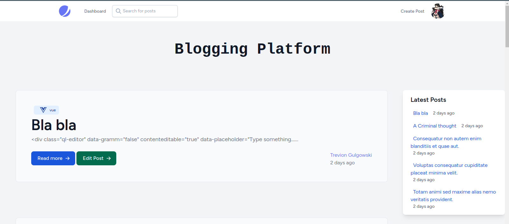
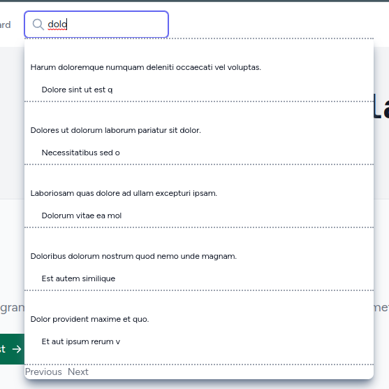
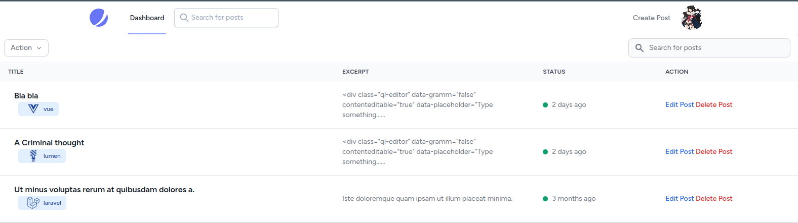
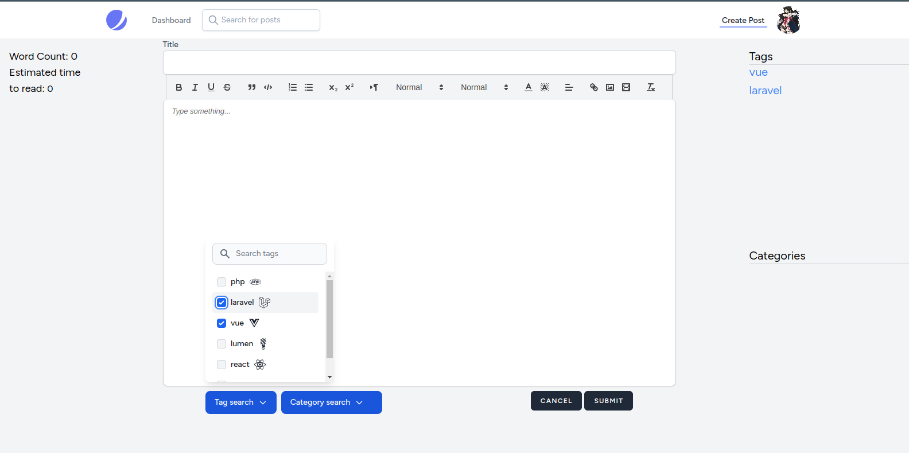

# Blogging Platform CMS

A Blogging Platform CMS using the Laravel TALL Stack.


[](https://choosealicense.com/licenses/mit/)
[](https://opensource.org/licenses/)
[](http://www.gnu.org/licenses/agpl-3.0)


## Features

- Complete CRUD system for Posts
- Comments and replies on posts
- Like systems for Posts and Comments
- Follower system, users can follow and unfollow other users.
- User profile pages
- Posts are indexed with Scout on Meilisearch, searching for posts is blazingly fast.


## Tech Stack

**Client:** Alpinejs, TailwindCSS, javascript

**Server:** php, laravel, livewire, mySql, meilisearch


## Screenshots







## Run Locally

Clone the project

```bash
  git clone git@github.com:voiceinthedark/blogging-platform-cms.git
```

Go to the project directory

```bash
  cd blogging-platform-cms
```

Install dependencies

```bash
  docker build -t sail .
  npm install
```

Start the server

```bash
  sail up -d
  npm run dev
```


## Environment Variables

To run this project, you will need to add the following environment variables to your .env file

`cp .env.example .env`
And fill the DB_HOST name with your db


## Usage/Examples

```bash
sail artisan migrate --seed

```

## Progress


## Roadmap

- [x] Add Post notification
- [ ] Refactor and improve post creation/editing view
- [ ] Add Feed page
- [ ] Add DM system
- [ ] Add recommender system


## Feedback

If you have any feedback, please reach out at darkrisingforce@gmail.com


## Acknowledgements

- https://icons8.com/

# Hi, I'm Firas! 👋


## 🚀 About Me
I'm a full stack developer, curently working with the TALL stack (Tailwind, Alpinejs, Laravel and Livewire).


## 🛠 Skills
javascript, php, python and React

